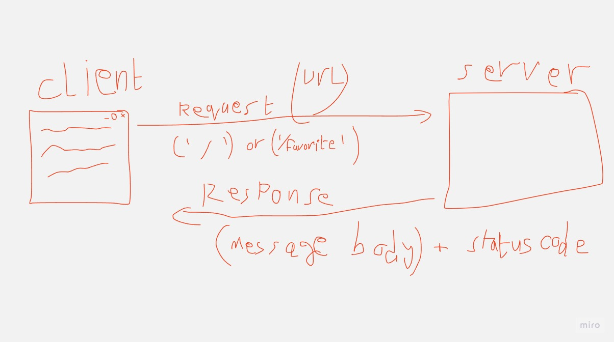

# Movies-Library - Project Version

**Author Name**: Abdallah alomari

## WRRC

## Overview

## Getting Started

* ### first step you have to clone this code ssh from this repo
* ### install required files by using `npm init -y`

* ### install express files `npm i express`

* ### to run server just use `npm start`
* ### and then go to  `http://localhost:3000/` you will get the main page of server Note: server down untill you turn it on as i mentioned before

* ### there is 2 routes for now 1 is `/` nad the second one is `/favorite`

## Project Features
<!-- What are the features included in you app -->
### until now i only have 2 routes 1 for home and the second for favorite movies but you will get more feature in next days so don't miss the new up comings things.