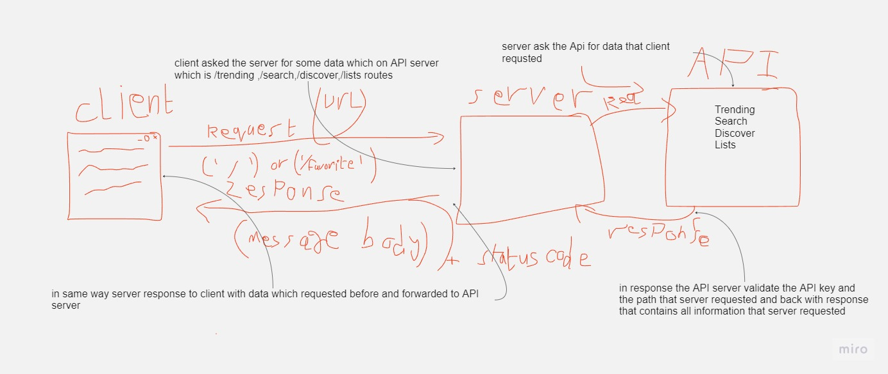
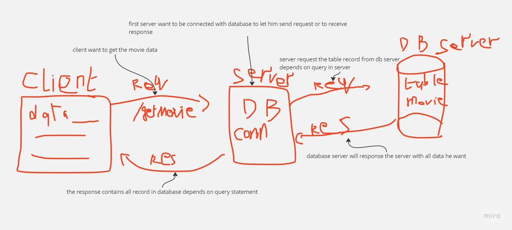

# Movies-Library - Project Version

**Author Name**: Abdallah alomari

## WRRC

## Overview

## Getting Started

* ### first step you have to clone this code ssh from this repo
* ### install required files by using `npm init -y`

* ### install express files `npm i express`

* ### to run server just use `npm start`
* ### and then go to  `http://localhost:3000/` you will get the main page of server Note: server down untill you turn it on as i mentioned before

* ### there is 2 routes for now 1 is `/` nad the second one is `/favorite`

# new changes 
## you have some packges to install to deal with this app 
* ### install dotenv package `npm install dotnev` 
* ### install axios package `npm install axios`
* ### install cors package `npm install cors`

* ### i have my own api key so you can use your apikey

* ### to use your api you can create `.env` file and store the api key inside variable which call `APIkey`. and you Good To Go

# LAB15

## install database

* ### you need to install postgresql package `npm i pg`

* ### you can run psql server by run this code `psql start`

* ### You have to create database using this code inside psql so type `psql` then insdie psql type `CREATE DATABASE <dbname>;` my data base name is `lab15`

* ### To connet datbase with psql server use this command `psql -d <dbname> -f <schema name>.sql` **note:** in my `schema.sql` file  i have 4 columns which is `(id,moviename,yearofmovie,rate)` and the id is serial which you dont have to insert it with values

* ### After this step you are conneted with your own database

* ### inside `.env` file you have to create variable called `DATABASE_URL` and store your postgresql database path which should be like this `postgressql://localhost:5432/db_name`

* ### you can use `Thunder` extension in VScode to make post request to insert value to database

* ### to show all database records in server use this path `localhost:3000/getmovie`

## Project Features
<!-- What are the features included in you app -->
### until now i only have 2 routes 1 for home and the second for favorite movies

# new features added (Update)

## - added 4 routes `/trending`,`/search`,`/discover`,`/list`

## new route added `/getmovie`

## - used constructor to show data

### **tip** : you can use JSON Formatter chrome extensions tp see the data clearly

[click here to download](https://chrome.google.com/webstore/detail/json-formatter/bcjindcccaagfpapjjmafapmmgkkhgoa?hl=en)